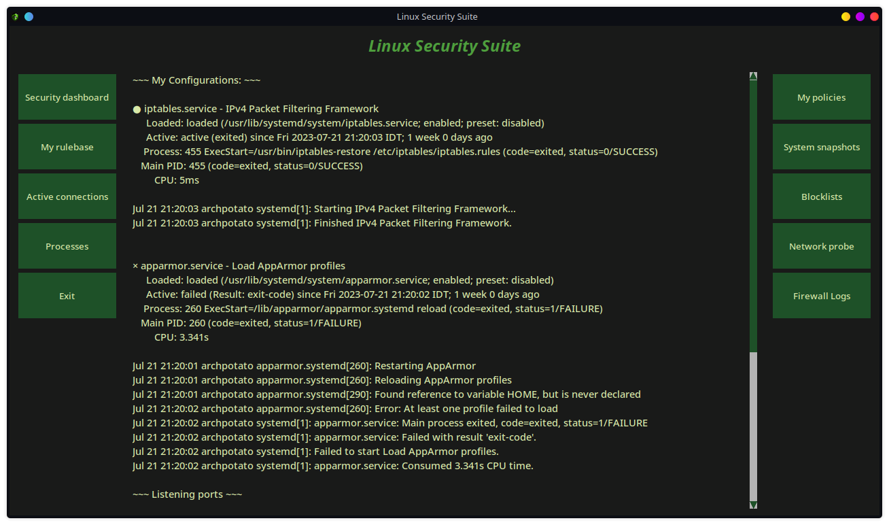
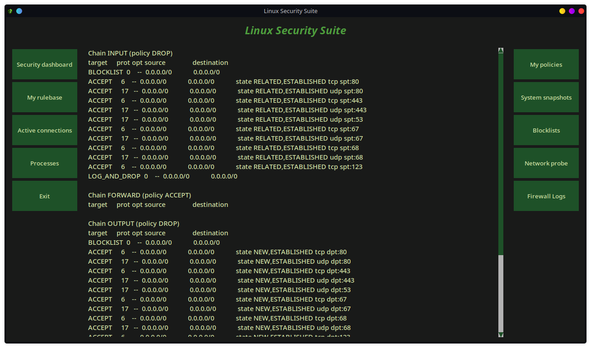
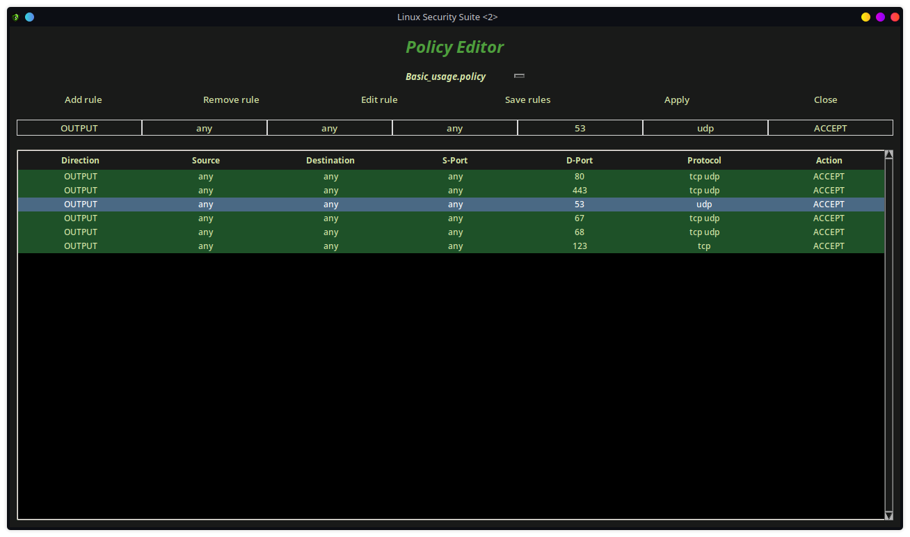
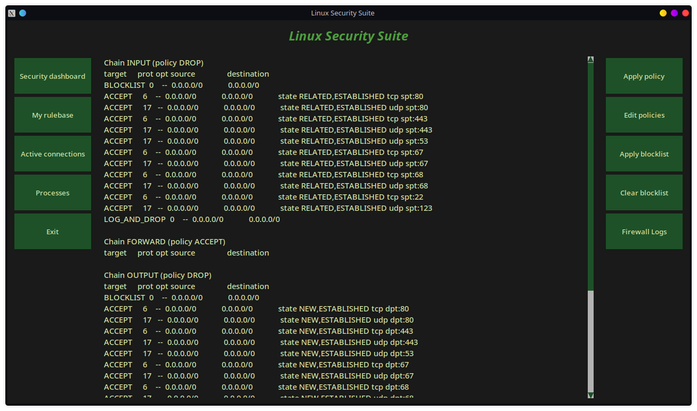
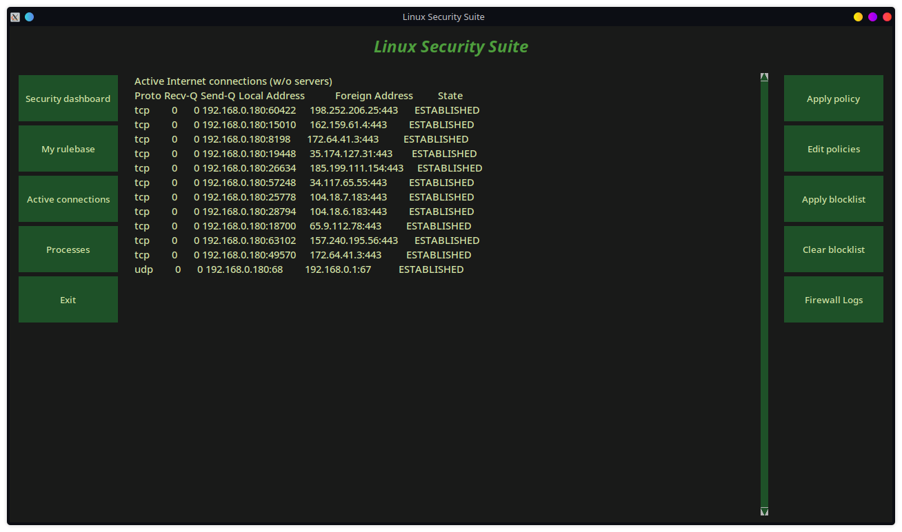
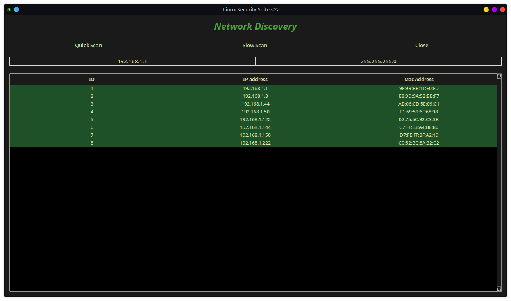

# Linux Security Suite (LSS)
## Securing your Linux machines has never been easier !

## Features
- Choose between different policies, comes with pre-built policy for basic usage.
- Add, edit, or remove rules from your chosen policy.
- Apply them at any time by using the apply policy button.
- Blocklist management - Use blocklist files to block dozens of ip addresses before the main chains applies.
- Network Discovery - probe your network for online devices.
- Encrypted system snapshots - backup your system files so you can restore them in case of failure.
- Ability to use domain names instead of IP addresses.
- Show latest dropped packets logs
- Monitor active connections and running processes

## Notes
- Root is required (of course)
- Iptables must be installed on the system (comes preinstalled in most linux distros).
- In order to see log files you must configure syslog-ng if it is not already comes with your linux.
- ./lss.py

## Screenshots

</img> </img> </img> </img> </img>  </img>

